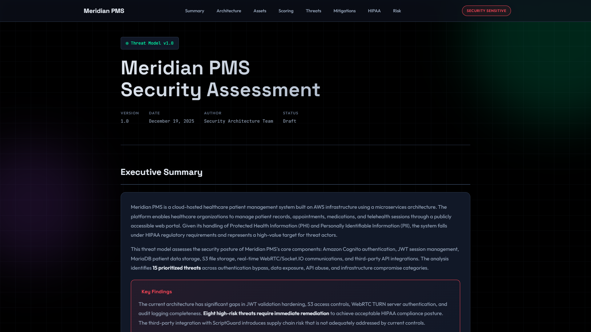

# Healthcare STRIDE Threat Model

A STRIDE-based threat model for a cloud-hosted healthcare patient management system, identifying 15 prioritised security threats and mapping remediation to HIPAA compliance requirements.

## Overview

Healthcare platforms handling Protected Health Information are high-value targets, yet many organisations deploy patient-facing systems without formal threat modelling. This project applies the STRIDE framework to CareConnect360 — a fictional but architecturally realistic patient management system built on AWS with a microservices architecture, MariaDB data tier, and real-time telehealth capabilities.

The threat model catalogues 15 threats across authentication bypass, data exposure, API abuse, and infrastructure compromise categories. Each high-risk finding includes a concrete mitigation with implementation code — JWT algorithm pinning, S3 bucket policy hardening, IDOR prevention middleware, parameterised queries, and TURN server credential generation. The full analysis maps every finding against specific HIPAA Security Rule sections (§164.312) to show exactly where architectural gaps create compliance exposure.

The deliverable is a professionally formatted HTML report designed for consumption by security leadership, complete with a Mermaid architecture diagram, risk-rated threat register, and a prioritised 90-day remediation roadmap.

## Architecture

The threat model analyses a multi-tier AWS architecture spanning five trust boundaries: a public-facing DMZ (WAF + ALB), an application tier (React frontend, Node.js API, Lambda functions, WebRTC/Socket.IO for telehealth), Amazon Cognito authentication with JWT session management, a data tier (MariaDB for patient records, S3 for document storage), and a monitoring layer (Prometheus + ELK Stack). Third-party integration with MedTrack Pro introduces an additional supply chain attack surface analysed separately.

## Tech Stack

**Security Frameworks**: STRIDE, OWASP Top 10, OWASP API Security Top 10, NIST SP 800-53

**Compliance**: HIPAA Security Rule (§164.308, §164.312)

**Target Architecture**: AWS (EC2, S3, Lambda, Cognito, WAF, ALB), MariaDB, WebRTC, Socket.IO

**Reporting**: HTML/CSS/Mermaid.js threat model report

**References**: CWE-287 (Improper Authentication), CWE-639 (Authorization Bypass)

## Key Decisions

- **STRIDE over DREAD or PASTA**: STRIDE maps directly to the spoofing, tampering, repudiation, information disclosure, denial of service, and elevation of privilege categories that matter most for a healthcare platform handling PHI — it surfaces threats by type rather than burying them in aggregate risk scores.

- **Code-level mitigations, not just recommendations**: Each high-risk threat includes working implementation code (Node.js/Express middleware, AWS policy JSON, GitHub Actions YAML) because telling a dev team "fix the auth" is less useful than showing them exactly how.

- **HIPAA section-level mapping**: Rather than a generic "HIPAA compliant" checkbox, the model maps each threat to the specific §164 subsection it violates, making it actionable for compliance officers preparing for audit.

- **HTML report format**: A self-contained HTML file with Mermaid diagrams renders anywhere without tooling dependencies, making it easy to share with non-technical stakeholders who need to understand the risk posture.

## Screenshots

[View Interactive Threat Model](https://nfroze.github.io/Healthcare-Threat-Model-STRIDE-Analysis/threatmodel.html)

## Author

**Noah Frost**

- Website: [noahfrost.co.uk](https://noahfrost.co.uk)
- GitHub: [github.com/nfroze](https://github.com/nfroze)
- LinkedIn: [linkedin.com/in/nfroze](https://linkedin.com/in/nfroze)
